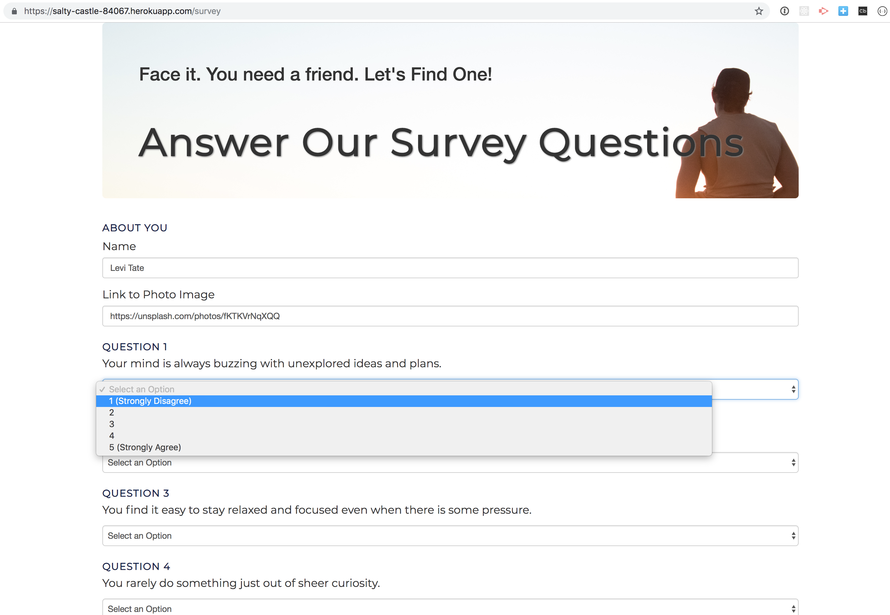
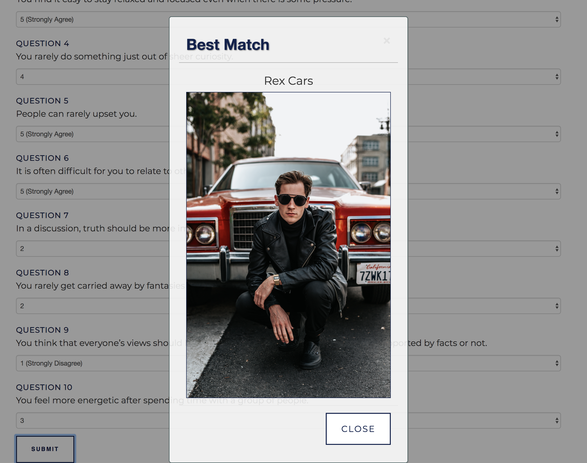

# Friend Finder - Node & Express Servers

## Live Site
https://salty-castle-84067.herokuapp.com/
---
## A Few Sample Name/Photo examples to try if you visit the live site

- Levi Tate          &mdash;   https://images.unsplash.com/photo-1461800919507-79b16743b257
- Constance Noring   &mdash;   https://images.unsplash.com/photo-1499552442814-13341b4aed72
- Chad Terbachs      &mdash;   https://images.unsplash.com/photo-1542327897-4141b355e20e
- Jean Yuss          &mdash;   https://images.unsplash.com/photo-1515073838964-4d4d56a58b21
- Miles Ahed         &mdash;   https://images.unsplash.com/photo-1535021766333-fc75c9ab1d62
- Dinah Mite         &mdash;   https://images.unsplash.com/photo-1536315999595-488b5d8f4d2d
- Andy Gravity       &mdash;   https://images.unsplash.com/photo-1494022299300-899b96e49893
- Hedda Hare         &mdash;   https://images.unsplash.com/photo-1535579710123-3c0f261c474e

## Overview
- A Node & Express based web application that simulates a simple dating app.  A full-stack site that uses Express to handle routing.  
   

## Description
- Friend Finder implements friend matching based on the user's responses to a ten-question survey. The user responds to questions with values from 1 (Strongly Disagree) to 5 (Strongly Agree). 

- When the survey is submitted, the existing user record closest to the current user's responses is found and returned. The closest set of user responses is defined as the set with the lowest absolute difference for all ten questions combined.

## See All Friends
- The user can link to a view of all friends via the homepage.  

## Technologies Used
- Node.js
- express NPM Package https://www.npmjs.com/package/express
- path NPM Package https://www.npmjs.com/package/path

